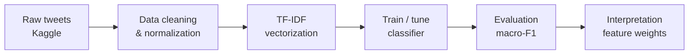

# Sentiment Analysis of Public Reaction on Platform X
### Entity-Level Sentiment Classification of Public Posts on X (Twitter)

**Author:** Laela Citra Asih
**Course:** Prinsip Sains Data
**Date:** June 2026

---

## Abstract

Public posts on Platform X (formerly Twitter) contain a vast, real-time stream of opinion
toward brands, products, games, and companies. This study develops and evaluates an
end-to-end machine-learning pipeline to automatically classify public posts into three
sentiment classes: **positive, negative, and neutral**. Using the public Kaggle benchmark
*Twitter Entity Sentiment Analysis* (real, human-annotated tweets), we prepared a clean
3-class corpus of **11,942 posts across 32 entities** and compared a majority-class
baseline against four candidate models built on TF-IDF features. Among default models,
**Random Forest led with a macro-F1 of 0.756**, but after hyperparameter tuning the
interpretable **TF-IDF + Logistic Regression** model achieved the best overall result —
**macro-F1 0.801 and 80.3% accuracy** on a held-out test set — versus a baseline macro-F1
of just 0.180. Coefficient-based interpretation revealed clear emotional vocabulary driving
the positive and negative classes, while the neutral class was partly identified by URL/link
artifacts typical of news and automated posts. The results demonstrate that lightweight,
interpretable classical ML remains a strong, practical choice for large-scale social-media
sentiment monitoring.

**Keywords:** sentiment analysis, entity-level sentiment, text classification, TF-IDF,
logistic regression, social media, Twitter/X

---

## Table of Contents
1. [Introduction](#1-introduction)
2. [Methodology](#2-methodology)
3. [Results](#3-results)
4. [Discussion (Interpretation of Results)](#4-discussion-interpretation-of-results)
5. [Limitations](#5-limitations)
6. [Conclusion and Future Work](#6-conclusion-and-future-work)
7. [References](#references)

---

## 1. Introduction

### 1.1 Background
Every day, users on Platform X post millions of reactions to brands, products, and
companies — from praise and excitement to complaints and criticism. This public discourse
is valuable for businesses and analysts but impossible to read manually at scale, and the
language is informal and noisy (slang, emojis, hashtags, mentions, URLs).

### 1.2 Problem Statement
> Given a short, unstructured public post on Platform X about some entity, can we
> automatically and reliably classify its sentiment into **positive**, **negative**, or
> **neutral**?

### 1.3 Objectives
1. Build a reproducible, end-to-end sentiment-classification pipeline on real Twitter data.
2. Compare classical ML models and select the best performer.
3. Interpret the linguistic drivers of each sentiment class.

### 1.4 Research Questions
- **RQ1:** Can classical ML on TF-IDF features classify entity-level sentiment
  substantially better than a majority-class baseline?
- **RQ2:** Which model family (linear, probabilistic, or ensemble) performs best?
- **RQ3:** Which words/phrases most strongly drive each sentiment class?

### 1.5 Hypotheses
- **H1:** A well-tuned model on TF-IDF beats the baseline by a large macro-F1 margin.
- **H2:** Bi-grams add discriminative power over uni-grams alone.

---

## 2. Methodology

### 2.1 Research Design
A supervised **multi-class text classification** task: learn `f(x) → y`, where `x` is a
raw post and `y ∈ {positive, negative, neutral}`. The end-to-end pipeline is:



Formally: `x → clean(x) → TF-IDF(x) → classifier → ŷ`.

### 2.2 Data Collection
The corpus is the public Kaggle dataset **"Twitter Entity Sentiment Analysis"**
(`jp797498e/twitter-entity-sentiment-analysis`) — real tweets, each human-annotated with
the sentiment expressed toward a target entity. It is downloaded reproducibly:

```python
import kagglehub
path = kagglehub.dataset_download("jp797498e/twitter-entity-sentiment-analysis")
# twitter_training.csv (~74,682 rows), columns (no header): [tweet_id, topic, sentiment, text]
```

### 2.3 Dataset Description

**Summary (standard fields)**

| Field | Value |
|---|---|
| Dataset Name / Source | Twitter Entity Sentiment Analysis — Kaggle (`jp797498e/twitter-entity-sentiment-analysis`) |
| Number of Samples | 11,942 (stratified sample of 12,000 from ~74,682 original) |
| Number of Features | 1 predictive text field → up to 5,000 TF-IDF features (+ 10 engineered structural features for EDA) |
| Target Variable | `sentiment` (positive / negative / neutral) |
| Task Type | Classification (multi-class, 3 classes) |
| Class Balance | 37.0% negative · 33.3% positive · 29.7% neutral |
| Missing Values | 686 null texts in the original (removed); 58 rows emptied by cleaning (removed) |
| License / Terms of Use | Public Kaggle dataset for academic/research use; X Developer Policy applies to redistribution |

**Schema (normalized)**

| Property | Value |
|---|---|
| Source | Kaggle — Twitter Entity Sentiment Analysis (real, human-annotated) |
| Original size | ~74,682 posts, 32 entities, 4 labels (Pos/Neg/Neu/**Irrelevant**) |
| Posts used (after preparation) | **11,942** (from a stratified 12,000 sample) |
| Entities / topics | 32 (e.g., Borderlands, Amazon, Microsoft, FIFA) |
| Columns | `tweet_id`, `topic`, `text`, `sentiment` |

### 2.4 Data Preparation & Cleaning
1. **Drop the `Irrelevant` class** — it marks posts *not relevant* to the entity (a
   relevance flag, not a sentiment), so it is excluded to keep a clean 3-class problem.
2. Remove null/empty texts and **exact-duplicate posts**.
3. **Stratified down-sampling** to 12,000 posts (class proportions preserved) for an
   interactive, responsive app (configurable; the full corpus can be enabled).
4. **Text normalization** per post: lowercase → remove URLs → remove @mentions → keep
   hashtag word (drop `#`) → strip emojis → cap character elongation (*loveee → lovee*)
   → remove numbers/punctuation → remove stop-words → collapse whitespace.
5. Drop rows that became empty after cleaning (**58 removed**, e.g. emoji/link-only posts).

Result: **11,942 clean posts**.

### 2.5 Class Balance
| Sentiment | Count | Share |
|---|---|---|
| Negative | 4,434 | 37.0% |
| Positive | 3,995 | 33.3% |
| Neutral | 3,571 | 29.7% |

Moderately imbalanced (complaints dominate) — hence **macro-F1** is the primary metric.

### 2.6 Feature Engineering
- **Primary representation:** TF-IDF (uni-grams + bi-grams, sublinear TF, `min_df=2`,
  `max_df=0.9`, `max_features=5000`).
- **Structural features (for EDA):** char/word counts, hashtag/mention counts, `has_url`,
  exclamation/question counts, emoji count, uppercase ratio.

### 2.7 Modeling
All models use a unified scikit-learn `Pipeline` (vectorizer + classifier fitted together
to prevent leakage):

| Role | Model |
|---|---|
| Baseline | Majority-class `DummyClassifier` |
| Candidate | Logistic Regression |
| Candidate | Multinomial Naive Bayes |
| Candidate | Linear SVM |
| Candidate | Random Forest |

### 2.8 Validation & Tuning
- Stratified **80/20 train–test split** (`random_state=42`): 9,553 train / 2,389 test.
- Stratified **5-fold cross-validation** (scoring = macro-F1) for model selection.
- **GridSearchCV** over `ngram_range`, `min_df`, `max_df`, `C` (36 configs × 5 = 180 fits).

### 2.9 Evaluation Metrics
Primary metric: **macro-averaged F1** (robust to class imbalance), supported by accuracy,
precision, and recall.

---

## 3. Results

### 3.1 Exploratory Data Analysis
- Sentiment is **net-negative** overall (37% negative), typical of brand/product discourse.
- Sentiment skews differently **per entity** — some brands/games attract far more negative
  reaction than others.
- Negative posts tend to be slightly longer (detailed complaints); neutral posts often
  contain links.

### 3.2 Baseline Model
| Metric | Value |
|---|---|
| Accuracy | 0.370 |
| Macro-F1 | 0.180 |

The baseline always predicts the majority class; its very low macro-F1 confirms it fails
on minority classes and sets the floor to beat.

### 3.3 Candidate Models (held-out test set)
| Model | Accuracy | Precision (macro) | Recall (macro) | F1 (macro) |
|---|---|---|---|---|
| **Random Forest** | **0.760** | 0.762 | 0.754 | **0.756** |
| Linear SVM | 0.735 | 0.732 | 0.730 | 0.731 |
| Logistic Regression | 0.721 | 0.718 | 0.714 | 0.714 |
| Multinomial NB | 0.701 | 0.705 | 0.690 | 0.690 |
| Baseline (Majority) | 0.370 | 0.123 | 0.333 | 0.180 |

### 3.4 Cross-Validation (stratified 5-fold, macro-F1)
| Model | CV F1 (mean) | CV F1 (std) |
|---|---|---|
| Random Forest | 0.750 | 0.009 |
| Linear SVM | 0.717 | 0.012 |
| Logistic Regression | 0.706 | 0.013 |
| Multinomial NB | 0.677 | 0.010 |
| Baseline (Majority) | 0.180 | 0.000 |

Low standard deviations indicate stable, trustworthy estimates.

### 3.5 Hyperparameter Tuning
GridSearchCV on TF-IDF + Logistic Regression — best configuration:
`C=10.0`, `ngram_range=(1,2)`, `min_df=1`, `max_df=0.9` → **best CV macro-F1 = 0.773**.

### 3.6 Best Model Performance
The tuned **TF-IDF + Logistic Regression** on the held-out test set:
- Accuracy: **0.803** · Macro-F1: **0.801**
- Improvement over baseline: **+0.621 macro-F1** (0.180 → 0.801).
- **Notably, tuning lifts Logistic Regression from 0.714 → 0.801**, overtaking the best
  default model (Random Forest, 0.756) while remaining fully interpretable.

**Per-class performance (held-out test set, n = 2,389)**

| Class | Precision | Recall | F1-score | Support |
|---|---|---|---|---|
| Negative | 0.812 | 0.845 | 0.828 | 883 |
| Neutral | 0.787 | 0.755 | 0.771 | 710 |
| Positive | 0.807 | 0.800 | 0.804 | 796 |
| **Macro avg** | **0.802** | **0.800** | **0.801** | 2,389 |
| Weighted avg | 0.803 | 0.803 | 0.803 | 2,389 |

The **neutral** class is hardest (F1 = 0.771), as expected — neutral posts overlap with
both polarities and are partly identified by link artifacts.

### 3.7 Error Analysis
**470 of 2,389** test posts were misclassified (~19.7% error rate).

**Confusion matrix** (rows = true, columns = predicted)

| | pred negative | pred neutral | pred positive |
|---|---|---|---|
| **true negative** | 746 | 72 | 65 |
| **true neutral** | 87 | 536 | 87 |
| **true positive** | 86 | 73 | 637 |

The off-diagonal cells show most errors are **neutral ↔ polar** confusions (e.g., 87
neutral posts predicted negative, 87 neutral predicted positive). Dominant failure modes:
- **Neutral ↔ polar confusion:** factual/news posts that contain emotional vocabulary.
- **Sarcasm & negation:** e.g., "great, another update that breaks everything" reads
  positive lexically but is negative.
- **Very short posts:** too few tokens for a confident prediction.
- **Entity-dependent tone:** the same word can be positive for one entity and negative for
  another — a bag-of-words model cannot fully capture this.

### 3.8 Feature Importance
Per-class TF-IDF coefficients (tuned Logistic Regression):
- **Positive:** *love, amazing, awesome, excited, best, thanks, nice*
- **Negative:** *worst, hate, fix, broken, servers* + strong profanity (frustrated complaints)
- **Neutral:** **URL/link fragments** (*com, dlvr, ly, tt*) and informational words — many
  neutral posts are news shares or automated link posts.

---

## 4. Discussion (Interpretation of Results)

- **RQ1 (✅ H1 supported):** The tuned model (test macro-F1 **0.801**, CV 0.773) vastly
  exceeds the baseline (0.180), confirming the task is learnable from TF-IDF features.
- **RQ2:** Among *default* models, the **non-linear Random Forest** leads (0.756). However,
  after tuning, the **linear Logistic Regression** becomes the best overall (0.801),
  delivering top accuracy *and* interpretability — the most practical deployment choice.
- **RQ3 (✅ H2 supported):** Feature importance shows interpretable emotional cues; the best
  configuration uses **bi-grams**, confirming they add discriminative power.

**Practical implications:**
- A lightweight, interpretable model is sufficient for real-time brand-sentiment
  monitoring on Platform X — cheap to train, fast to serve, and auditable.
- Sentiment skews per entity, so dashboards should report sentiment **per entity**, not
  only in aggregate.

---

## 5. Limitations
1. TF-IDF (bag-of-words) ignores word order and struggles with **sarcasm and negation**.
2. Sentiment is **entity-dependent**; the same word can flip meaning across entities.
3. **English-only**; a stratified 12k sample is used for app responsiveness (the full ~74k
   corpus can be enabled in `src/load_data.py`).
4. Neutral predictions partly rely on **link artifacts** rather than true opinion.

---

## 6. Conclusion and Future Work
This study delivered a complete, reproducible pipeline — from data collection and cleaning
through EDA, feature engineering, modeling, tuning, and interpretation — for classifying
public sentiment on Platform X using a real, human-annotated Twitter benchmark. The tuned
Logistic Regression model provides accurate (80.3%), stable, and explainable predictions.

**Future work:** (1) replace/augment TF-IDF with transformer embeddings (fine-tuned
BERT/RoBERTa) to capture context, sarcasm, and entity-aware sentiment; (2) add
aspect/entity-based sentiment analysis; (3) concatenate engineered structural features with
TF-IDF in a stacked model; (4) deploy as a streaming dashboard with per-entity trend alerts.

---

## References
1. Pang, B., & Lee, L. (2008). *Opinion Mining and Sentiment Analysis.* Foundations and Trends in Information Retrieval.
2. Pedregosa, F., et al. (2011). *Scikit-learn: Machine Learning in Python.* JMLR, 12, 2825–2830.
3. Manning, C., Raghavan, P., & Schütze, H. (2008). *Introduction to Information Retrieval.* Cambridge University Press.
4. Devlin, J., et al. (2019). *BERT: Pre-training of Deep Bidirectional Transformers for Language Understanding.* NAACL.
5. *Twitter Entity Sentiment Analysis* dataset. Kaggle. https://www.kaggle.com/datasets/jp797498e/twitter-entity-sentiment-analysis

---

### Notes before submitting
- Replace `[Your Name]` and add your student ID / supervisor.
- All figures above were produced by the project's pipeline on a stratified 12,000-post
  sample (`random_state=42`); regenerating with a different seed/sample may shift numbers
  slightly.
- Consider adding screenshots from the Streamlit app (EDA charts, confusion matrix,
  feature-importance bars) as figures.
